# String Calculator – TDD Kata 🧪

A simple **String Calculator** implemented using **Test-Driven Development (TDD)**.  
This project demonstrates the **Red → Green → Refactor** workflow and showcases my ability to write clean, well-tested code.

---

## 🚀 Features

- Returns 0 for an empty string
- Returns a single number correctly
- Supports multiple numbers separated by commas
- Supports new lines (`\n`) as a delimiter
- Supports custom single-character delimiters (e.g., `//;\n1;2`)
- Throws an exception for negative numbers and lists all negative numbers

---

## 🧪 TDD Workflow (Red → Green → Refactor)

This project was developed step-by-step using TDD.  
Each step contains **failing tests (RED)**, minimal code to **pass the test (GREEN)**, and optional **refactoring**.

### Step Screenshots

| Step | Description                                      | Screenshot                 |
| ---- | ------------------------------------------------ | -------------------------- |
| 1    | Failing test for empty string                    | 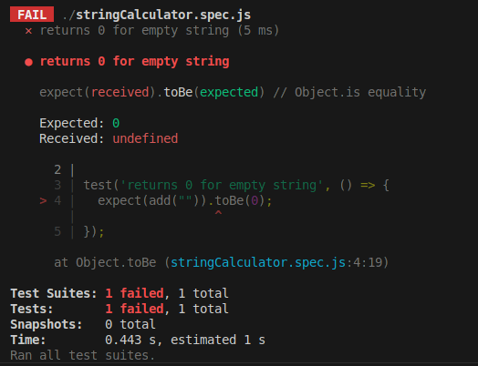 |
| 1    | Test passes after implementing minimal code      | 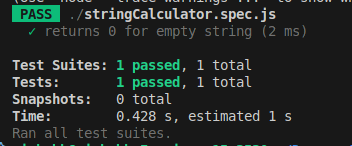 |
| 2    | Failing test for single number                   | 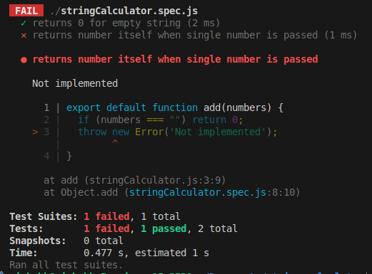 |
| 2    | Test passes for single number                    | 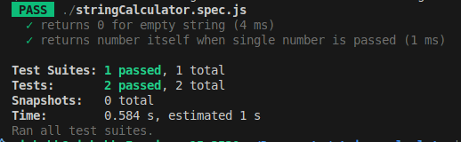 |
| 3    | Failing test for two numbers                     | 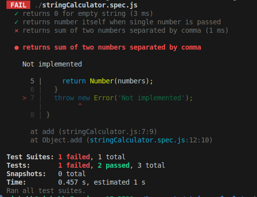 |
| 3    | Test passes for two numbers                      | 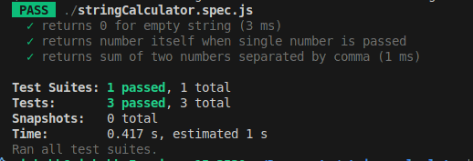 |
| 4    | Test passes for multiple comma-separated numbers | 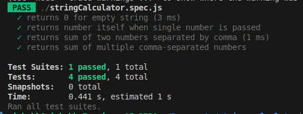 |
| 5    | Failing test for new line delimiter              | 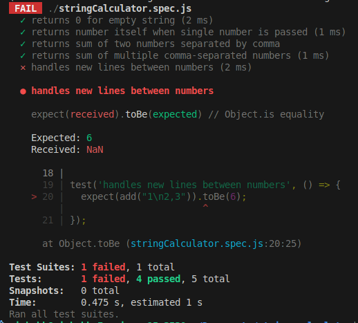 |
| 5    | Test passes for new line delimiter               | 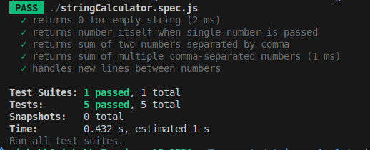 |
| 6    | Failing test for custom delimiter                | 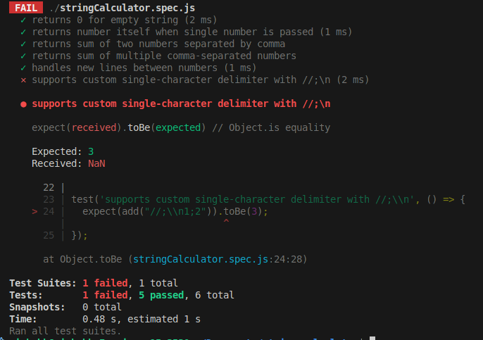 |
| 6    | Test passes for custom delimiter                 |  |
| 7    | Failing test for negative numbers                | 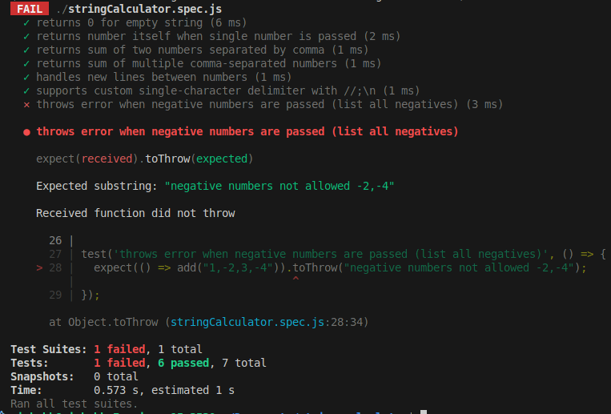 |
| 7    | Test passes with correct negative number error   | 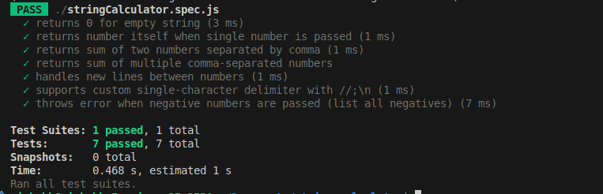 |

---

## 📂 Project Structure

string-calculator-tdd/
├── stringCalculator.js # Main implementation
├── stringCalculator.test.js # Jest test cases
├── package.json
├── README.md
└── docs/ # Screenshots for each step

---

## 🛠️ Installation & Usage

1. Clone the repository:

```bash
git clone https://github.com/rishabh-in/string-calculator-tdd.git
cd string-calculator-tdd
npm install
npm test
```
